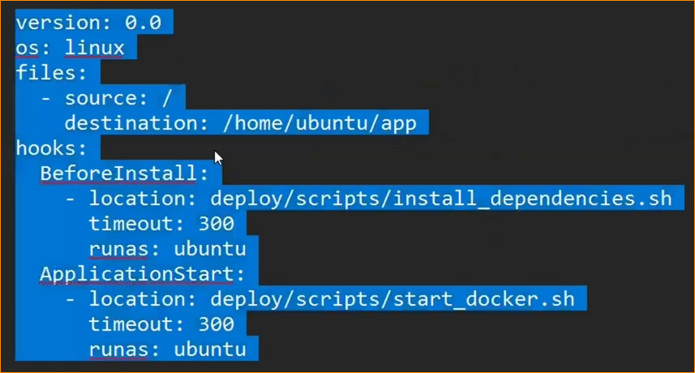

-- **Project Setup** --

1. create github repo from ml template

2. clone on local pc (clean based on current project)

3. create venv

4. host mlflow on dagshub

    --------------------------------------------------------------------------------------------
    https://dagshub.com/iamprashantjain/Emotion-Detection-MLOps.mlflow

    import dagshub
    dagshub.init(repo_owner='iamprashantjain', repo_name='Emotion-Detection-MLOps', mlflow=True)

    import mlflow
    with mlflow.start_run():
    mlflow.log_param('parameter name', 'value')
    mlflow.log_metric('metric name', 1)

    --------------------------------------------------------------------------------------------

-- **Experiments** --

5. test mlflow if connected

6. run 3 experiments
    - baseline, bow vs tfidf -- this will give best model & best vectorizer
    - from there find best parameters of that algo & vectorizer combincation
    - track all experiments on mlflow hosted on dagshub

-- **DVC Pipeline** --

7. dvc init
8. add dvc remote (local or s3) - echo %TEMP%
9. crate dvc pipeline (dvc.yaml + params.yaml)
10. send best model to model_registry
11. create s3 bucket
12. add s3 dvc remote

-- **Model Serving** --

13. write a code to fetch model from model_registry, create flask app and make predictions

-- **CI/CD** --

14. apply CI
    - generate requirements_dev.txt
    - create .github/workflows/ci.yaml
    - run dvc pipeline on github actions means latest model will be registered in staging stage
        - error: "Authorization Required: dagshub auth required to access mlflow hosted on dagshub" -- create github secret variable of dagshub token
        - error: src not found - use PYTHONPATH
    - test model: load model, model signature to avoid shape mismatch
        - model test: check if model loading correctly (1_model_loading.py)
    - model performance
    - once testing completed then promote model to production
    - flask app test
    - model in produciton will be used by flask app to make predictions

15. create Docker image
    - add ci/cd step to dockerize just flask_app and its dependecies like vectorizer etc -- no need to dockerize whole project
    - create seperate requirements_prod.txt -- use pipreqs / pipreqs . --force
    - add host="0.0.0.0" in flask app to make it accessible from outside of docker
    - add production server : gunicorn
        + add gunicorn in requirements
        + add "CMD['gunicorn','-b','0.0.0.0:5000','app.py']" in dockerfile
    - create docker image using buildkit for faster execution:
        + set DOCKER_BUILDKIT=1
        + docker build -t emotion-detector:latest .
        + solve DAGSHUB_PAT environment variable -- docker run -p 5000:5000 -e DAGSHUB_PAT=your_actual_token emotion-detector:latest
        + docker run -p 5000:5000 -e DAGSHUB_PAT=bd4136ab964348874ebb74d06e9d10f5bf763d52 emotion-detector:latest
        + docker build -t emotion-detector:latest . && docker run -p 5000:5000 -e DAGSHUB_PAT=your_actual_token emotion-detector:latest
        

16. apply docker image creation in CI
    - build docker image via ci.yaml

17. Deployment
   1. ***ECR to EC2***

      - ***Why ECR instead of Dockerhub***
         1. Tightly integrated with other AWS services
         2. IAM based access control
         3. High availability & Automatic scaling for n number of push-pulls
         4. Security: all repos are private by default
         5. ECR repos are automatically encrypted
         6. VPC endpoints (not available on public internet)
         7. Highly cost effective
         8. No rate limits unlike dockerhub
         9. All repos will be scanned for Vulnerability check
         10. Global coverage of servers
         11. Image lifecycle management: we can set policies or rules to manage image lifecycle when to archive or delete etc
         12. Fully managed services - No need to worry about infra
         13. ECR integrates easily with CI/CD
         14. Support multi architecture images like windows, linux or max os

      - Create ECR repo
            - Create ECR: "prashant-mlops-ecr" normally without changing any settings
      
      - Push docker image to ECR via ci.yaml
         - "View push commands" to know how to push docker image to ECR
            1. aws ecr get-login-password --region ap-south-1 | docker login --username AWS --password-stdin 739275446561.dkr.ecr.ap-south-1.amazonaws.com
            2. docker build -t prashant-mlops-ecr .

      - In EC2, we will pull image from ECR and run via cicd pipeline
            1. create EC2

            2. run below commands to setup EC2

            3. after setup done, update cicd pipeline
            4. updated AWS security groups

      - **How to Optimize & Reduce Docker image size**
         1. choose minimal base image like python: 3.9 - Alpine
         2. use multi stage builds (use temp & final container)
         3. minimize layers
         4. use .dockerignorefile
         5. minimize python package -- use "no-cache-dir"
         6. remove unnecessary files

   2. ***ECR TO ECS (Scalable & Advanced)***
    - ECS is a container orchestration service by AWS
        
        - *** What is orchestration? ***
        - Think of orchestration like a conductor of an orchestra — managing when and how each instrument (service, container, or server) plays to create a smooth performance.
        - Orchestration means automatically managing and coordinating multiple services or containers so they work together smoothly.
        - In container systems (like Docker), orchestration tools (like ECS or Kubernetes) do things like:
            * Start/stop containers
            * Restart if they fail
            * Scale based on traffic
            * Connect them to each other
            * Handle deployments

        - It’s like a conductor making sure all parts of an app run in sync, reliably and automatically.
  
    - Till now we have deployed on single server - single server container deployment
        - **PROBLEM with current setup**
            1. Its not scalable means if a crowd of people come then it will not be able to handle
                - We can do scaling:
                    - vertical scaling: like increase ram etc
                    - Hotizontal scaling: add more servers -- most preferred in industry
            
                - SOLUTION: Create another server repeating the same steps of deploymetn again, similarly we can deploy as many server as we want.
                
                - Problem with this approach
                    1. We have to do it manually, what if we have 100s of servers. There are more chances of errors -- manual starting/stoping
                    2. Traffic routing -- (load balancing): how to route traffic to each server, how will it decide where to route? also how to decide load and how to balance? (No Load balancer available)
                    3. Rigid setup: Not flexible with traffic inflow. Its rigid where we have to start & stop servers based on traffic. (No Auto scaling available)
                    4. Manual updating: Update all servers maually in case of update in model
                    5. Potential downtime: When we are starting stopping servers there is a high chance of downtime which companies like ola/uber/swiggy cant afford
                    6. No health check: Whether servers are even avialble or died
                    7. No centralized logging & monitoring -- If we have 100 servers then it will be tiring
                    8. Security mgmt individually
                    9. Lack of service which will restart another server in case of any servier died
                    10. Complexity in CI/CD -- We have to write pipeline codes for 100s of servers seperatly

                - We will try to solve above problems while stying with EC2
                    1. We can create template of our server in AWS: AMI (Amazon Machine Images) -- which will be a copy of our running servers. In future whenever we need another server, we can just start it and it will be up and running. We have to run docker image manually though. For that we can add user-data script while creating server and docker image will be up and running. Now we can copy paste new instance

                    2. Add Load balancer

                    3. Use Auto scaling groups which will check when new servers are required.. so it will start/stop based on requirements

                    4. Manual Updating -- x

                    5. Potential downtime -- ASG will handle it

                    6. Health check -- Load balancer & ASG will handle

                    7. Centralized Monitoring -- use ASG monitoring section

                    8. Security mgmt: can be handled with ASG

                    9. When server dies -- ASG will create new
                    
                    10. Complxity CI/CD -- x

                - Current Problems
                    1. Manual Updating -- when new model have been generated which will generate new docker image v2
                        - update code (like UI enhancement: color change)
                        - create docker image
                        - push to ECR
                        - edit launch template (use new user-data script to install package, docker start & enable, pull new image, stop old container, run new docker container)
                        - edit ASG (automatically picks latest: no need to change)
                        - stop old ec2 instance which will trigger ASG and new instance will be up based on updated docker image
                        - check logs for any issues: sudo cat /var/log/cloud-init-output.log
                        - (give power to EC2 to communicate with ECR as and when required)

                    2. Deployment strategy when updating -- still manual: we have to use better deployment satrtegy
                    3. Roll back mechanism -- If updated version fails then change version from latest to previous working version in ASG
                    4. Complexity in CI/CD

                
                - Currently We are pushing docker image to ECR and Deploying it on AWS ASG on EC2
                - We are updating launch template and using that to deploy latest version, manually closing old instances which triggers ASG to start new servers with latest instances -- Problem with this is that there will be some downtime
                - We want to automated all manual tasks using "AWS CodeDeploy"

        - **AWS Code Deploy**
            - Its a industry based deployment service by AWS

            1. Deployments - It has some built in deployment strategies

            2. Automated rollbacks - AWS codedeploy roll back to previous version automatically if new deployment fails

            3. Granular control over deployment - we can precisely manage how and when your app updates go live. It gives you detailed control over each part of the deployment process. It helps us to update apps safely and gradually, with the ability to test, monitor, and roll back, making your deployments reliable and low-risk.

            4. Seamless integration with CI/CD pipeline

        
        - **EC2 Deployment Workflow using AWS CodeDeploy + ASG + ECR**

        1. Create new launch template not existing one using below screenshot & new iam roles
        2. Create new ASG using launch template (We need to deploy ECR image to ASG which will be handled by code deploy)
        3. check if codedeploy agent is running? -- sudo service codedeploy-agent status
        
        - even though EC2 instances will be running on ASG, website still wont work bcoz docker is not installed, docker image is not running etc
        - now we will work on code deployment using "codedeploy" : Application -> Deployment Group -> Deployment
                
        4. CodeDeploy: Create a "application" and inside it create a "deployment group" : There are 2 types of updates: 
            1. In-place: It will update all/half/1 at a time instances in deployment group -- similar to rolling update and for that time its being updated, that app will be offline 
            2. Blue/Green: Blue = current version (v1) running in ECS, Green = new version (v2) deployed in parallel, 
                Test Green (v2) fully to ensure it works, If all tests pass, shift traffic from Blue (v1) to Green (v2) using a Load Balancer, After switch, delete Blue (v1) or keep it for rollback

        5. Connect deployment group with ASG (So deployment group will become ASG)
        6. Create new "deployment" and inside which we tell what to do at the time of deployment like pull image from ecr, run image etc -- appspec.yaml (provide it in revision type either saved on github or aws s3)
            - create a new file in project root folder : appspec.yml
            - write below code:

            - Hooks are steps where you can run custom actions before or after different phases of deployment

            

            - In before start, we are installing all dependencies
            - In after install, we are executing all aws ecr helper commands like pulling, deleting previous containers, running newly pulled container etc

        7. Run deployment

        - Since ASG is communicating with ECR and Codedeploy is also communicating with EC2, so we need those IAM roles setup already which will have access to those
        - We have to setup 2 iam roles inside "Launch Template"
        - Install "code deploy runner/agent" on each EC2 instance to run the deployment on ASG EC2 instances

**Deployment Strategies**
    <!-- (sess30: 902) -->
    1. Start-Stop: We stop current running machine, deploy new version of app on new instance and shift traffic to new one and delete older one
    2. Rolling deployment: Where we roll out new updates slowly means we update servers 1 by 1, so some users will still see old while they are being updated
    3. Blue-Green deployment: Blue is old version and green is new version, we test everything on green and once succeed then switch traffic from old to new and delete old version
    4. Canary deployment
    5. A/B testing
    6. Shadow deployment

